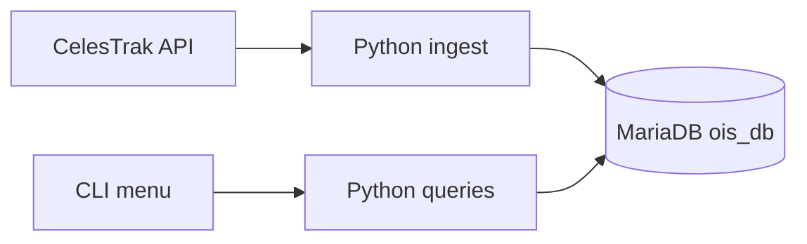

# Orbital Intelligence System

**OIS** is a MariaDB-backed catalog for satellite tracking. One Python ingest job pulls public orbital data, stores it with history, and a CLI runs search, collision-style alerts, and reports — without opening a SQL shell.

---

## Goals

- Ingest CelesTrak TLE/JSON into a normalized MariaDB schema
- Keep current orbit parameters and a growing position history
- Run collision-alert and operator/debris report queries from a CLI
- Stay demoable on a local machine for a DBMS course

## Non-goals

- Real-time tracking or production multi-user access
- High-fidelity orbit propagation (`sgp4` is optional later, not v1)
- Space-Track.org as a required source
- A web UI (Streamlit/Flask is optional polish)

---

## System overview

Three layers only: ingest, store, use.



| Layer | Responsibility | Tech |
|-------|----------------|------|
| **Ingest** | Fetch, parse, upsert, log the sync | Python, `requests` |
| **Store** | Schema, keys, history, alerts | MariaDB |
| **Use** | View, search, alerts, reports | Python CLI |

CelesTrak responses are cached as local JSON during development so the API is not hit in a loop.

---

## Schema

Database: `ois_db`.

MariaDB has no native inheritance, so satellite types are **subclass tables** (PK+FK to `Satellite`), not extra nullable columns on the parent.

```mermaid
erDiagram
    SATELLITE ||--|| ORBIT_PARAMETERS : has
    SATELLITE ||--o{ POSITION_HISTORY : records
    SATELLITE ||--o{ MANEUVERS : performs
    SATELLITE ||--o| COMM_SATELLITE : specializes
    SATELLITE ||--o| NAV_SATELLITE : specializes
    SATELLITE ||--o| EO_SATELLITE : specializes
    SATELLITE ||--o| SCI_SATELLITE : specializes
    SATELLITE ||--o{ COLLISION_ALERTS : "object A"
    SATELLITE ||--o{ COLLISION_ALERTS : "object B"
    SATELLITE ||--o{ DEBRIS_RECORDS : "optional parent"
    SYNC_LOG ||--o{ SATELLITE : "ingest run"

    SATELLITE {
        INT Satellite_ID PK
        VARCHAR NORAD_ID UK
        VARCHAR Name
        VARCHAR Operator
        VARCHAR Status
        DATE Launch_Date
    }
    ORBIT_PARAMETERS {
        INT Satellite_ID PK_FK
        DECIMAL Inclination
        DECIMAL Eccentricity
        DECIMAL Apogee_km
        DECIMAL Perigee_km
        DATETIME Epoch
    }
    POSITION_HISTORY {
        INT Position_ID PK
        INT Satellite_ID FK
        DATETIME Observed_At
        DECIMAL Lat
        DECIMAL Lon
        DECIMAL Alt_km
    }
    MANEUVERS {
        INT Maneuver_ID PK
        INT Satellite_ID FK
        DATETIME Maneuver_At
        VARCHAR Type
        VARCHAR Notes
    }
    COLLISION_ALERTS {
        INT Alert_ID PK
        INT Object_A_ID FK
        INT Object_B_ID FK
        DECIMAL Probability
        DECIMAL Distance_km
        DATETIME Detected_At
        VARCHAR Status
    }
    DEBRIS_RECORDS {
        INT Debris_ID PK
        INT Parent_Satellite_ID FK
        VARCHAR Catalog_ID
        DATETIME First_Seen
        VARCHAR Status
    }
    COMM_SATELLITE {
        INT Satellite_ID PK_FK
        VARCHAR Band
        INT Transponders
    }
    NAV_SATELLITE {
        INT Satellite_ID PK_FK
        VARCHAR Constellation
        VARCHAR Signal_Type
    }
    EO_SATELLITE {
        INT Satellite_ID PK_FK
        VARCHAR Sensor
        DECIMAL Resolution_m
    }
    SCI_SATELLITE {
        INT Satellite_ID PK_FK
        VARCHAR Mission
        VARCHAR Instrument
    }
    SYNC_LOG {
        INT Sync_ID PK
        DATETIME Synced_At
        VARCHAR Source
        INT Rows_Upserted
        VARCHAR Status
    }
```

### Relationships

| From | To | Cardinality | Why |
|------|----|-------------|-----|
| Satellite | Orbit_Parameters | 1:1 | One current orbital element set per satellite |
| Satellite | Position_History | 1:N | Each sample belongs to exactly one satellite |
| Satellite | Maneuvers | 1:N | A burn/event is owned by one satellite |
| Satellite | Comm / Nav / EO / Sci | 1:1 | Disjoint specialization; a row lives in at most one subclass |
| Satellite | Collision_Alerts | 1:N (twice) | An alert names two catalog objects |
| Satellite | Debris_Records | 1:N optional | Debris may come from a known parent |
| Sync_Log | — | independent | One row per ingest run |

Position history is **1:N, not M:N**: a position record is a measurement of one satellite. Sharing a row across satellites would break the meaning of the table.

Foreign keys use `ON DELETE CASCADE` so deleting a satellite removes its orbit, history, maneuvers, and type row.

`Collision_Probability` is `DECIMAL(5,2)` — a percentage, max 999.99.

---

## Data flow

**Sync**

1. Fetch CelesTrak JSON (or read `cache/` during development).
2. Upsert `Satellite` on `NORAD_ID`.
3. Upsert matching `Orbit_Parameters`.
4. Insert one `Position_History` row per satellite in this fetch.
5. Insert a `Sync_Log` row (source, timestamp, counts, status).

**Alert**

1. Take the latest position per satellite.
2. Compare pairs with a simple distance / dummy-probability check.
3. Insert qualifying rows into `Collision_Alerts`.

**Report**

- Satellites grouped by operator or type (join subclass tables).
- Debris count over time from `Debris_Records`.
- Optional linear extrapolation of last two positions as a “trajectory projection” for the course.

---

## Key decisions

| Decision | Rationale |
|----------|-----------|
| MariaDB only | Matches the project abstract; demo SQL stays portable to the viva machine |
| Python + `mysql-connector-python` | One language for ingest and CLI; no ORM required for a DBMS course |
| CelesTrak first | Free, no auth, JSON/TLE. Space-Track is optional later (account approval is slow) |
| Subclass tables for types | Cleaner than nullable type columns; defensible EER specialization |
| `NORAD_ID UNIQUE NOT NULL` | Natural upsert key; a catalog row is not useful without it |
| `Sync_Log` table | Makes “automatic updates” a stored fact, not a script side effect |
| CLI for v1 | Reliable demo path. Streamlit/Flask is extra, not required for Done |
| SQL-level collision check | Enough for the course; real conjunction analysis is out of scope |
| Local JSON cache | Avoids hammering CelesTrak while iterating on parse/upsert |

---

## Target repo layout

Not created in this docs step. Later phases add these paths:

```
.
├── architecture.md
├── plan.md
├── project.md
├── README.md
├── docker-compose.yml     # MariaDB 11 (ois / ois / ois_db)
├── sql/
│   ├── schema.sql
│   └── seed.sql
├── ingest/
│   └── celestrak.py
├── app/
│   ├── db.py
│   ├── cli.py
│   └── queries.py
├── cache/                 # local CelesTrak JSON while developing
└── docs/
    ├── viva.md
    └── er.dbml            # paste into dbdiagram.io
```

---

## Definition of done

A live local MariaDB instance, one Python command that pulls (or replays cached) CelesTrak data into the tables, and a CLI option that prints a collision-style report — without using the `mysql` shell.
